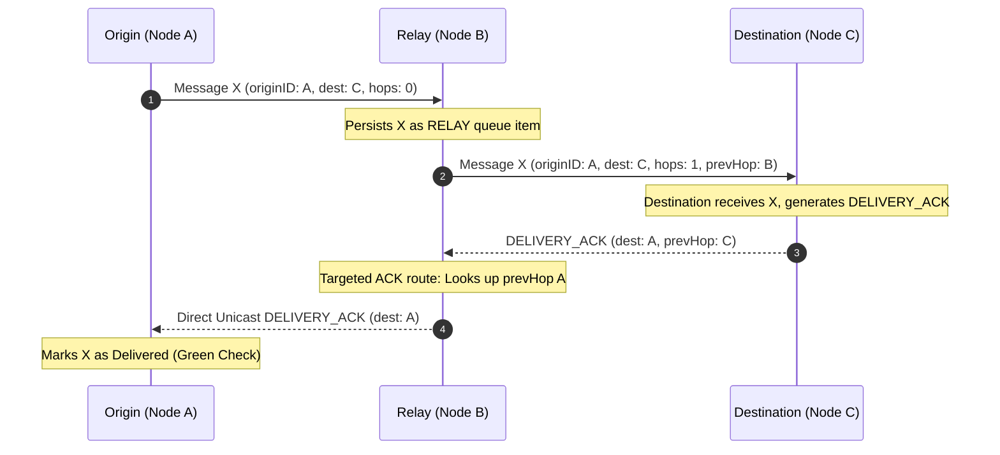

# Pingly Mesh Networking V2 Architecture & Protocol Specification

## 1. Overview
Pingly Mesh V2 is an off-grid, multi-hop, store-and-forward peer-to-peer messaging engine built for emergency and low-power communications over Bluetooth Low Energy (BLE) and MultipeerConnectivity (P2P Wi-Fi Direct / Bluetooth Classic).

---

## 2. Node Identity & Routing Model
- **Stable Node Identity (`NodeIdentity`)**: Each device generates a persistent node identifier (`NODE-XXXXXXXX`) on first launch using `UserDefaults`. Routing metadata (`originID`, `destinationID`, `previousHopID`) uses stable node IDs rather than user-selected display handles, preventing routing collisions when two users share identical display names.
- **Display Handles (`senderName`)**: User handles (e.g. `"Aditya rai"`) are kept purely for UI display cards and chat bubble headers.

```text
+-----------------------------------------------------------------------+
|                            MESSAGE ENVELOPE                           |
+-----------------------------------------------------------------------+
|  id: UUID                 | Stable message identifier                 |
|  originID: String         | Authoring Node ID (NODE-XXXXXXXX)         |
|  destinationID: String    | Target Node ID or "BROADCAST"             |
|  senderID: String         | Transmitting Node ID                      |
|  previousHopID: String    | Immediate previous hop Node ID            |
|  hopsCount: Int           | Number of hops traversed                  |
|  ttl: Int                 | Maximum permitted hops (Default: 3)       |
|  protocolVersion: Int     | Protocol version (Default: 2)             |
|  authTag: String          | CryptoKit HMAC-SHA256 signature tag       |
+-----------------------------------------------------------------------+
```

---

## 3. Targeted ACK Routing & Two-Tier ACK Model
- **HOP_ACK**: 1-hop link confirmation between adjacent mesh nodes.
- **DELIVERY_ACK**: End-to-end receipt confirmation generated exclusively by the final destination node (`destinationID`).
- **Targeted Reverse-Path ACK Routing**: Intermediate nodes use persistent reverse-path metadata stored in `SDPendingMessage` (`previousHopID`) to route `DELIVERY_ACK` directly to the preceding hop via direct unicast (`sendData(data, toPeers: [targetPeer])`), eliminating un-targeted broadcast flooding storms.



---

## 4. Cryptographic Envelope Authentication (`MeshSecurityManager`)
- **CryptoKit HMAC-SHA256**: All outgoing `Message` payloads automatically compute an HMAC-SHA256 authentication tag over canonical packet fields (`messageID`, `originID`, `destinationID`, `timestamp`, `text`).
- **Rejection of Forged Packets**: `MultipeerService` verifies `authTag` via `MeshSecurityManager.shared.verify(message:)` before processing. Forged messages or forged ACKs are dropped silently without altering database or UI state.

---

## 5. Queue Hardening & Concurrency Safety
- **TOCTOU Race Prevention**: `SwiftDataService` enforces an internal `NSLock` serial boundary around pending queue insertions (`enqueuePendingMessage`), preventing concurrent async callbacks from inserting duplicate records for the same `messageID`.
- **SOS Queue Priority**: Emergency SOS messages (`isSOS == true` / `priorityRaw == 2`) are prioritized ahead of normal chat messages during queue flushing.
- **Payload Size Limits**: Enforces a strict 64 KB application limit (`Constants.Mesh.maxPayloadBytes`) on text/transcript envelopes.
- **Persistent Expiration**: Automatically purges pending store-and-forward items older than 7 days (`expiresAt < Date()`).

---

## 6. Performance & Background Execution
- **Off-Main-Thread Processing**: JSON decoding, HMAC verification, and routing decisions execute on background queue `DispatchQueue.global(qos: .userInitiated)`. Main thread dispatches UI state updates only.
- **Coalesced Queue Flushing**: `actor QueueProcessingCoalescer` prevents parallel duplicate queue processing calls during peer connection bursts.
